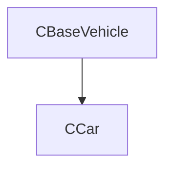

## Chapter 3: Methods and Messages
-----
In the world of Object-Oriented Programming, objects aren't just passive containers of data; they're active participants that can perform actions and communicate with each other. This behavior is defined by **methods**, and the way objects trigger these actions is through **message passing**.

### 3.1 Defining **Methods**: `METHOD`

A **method** is simply a function or a procedure that belongs to a class. It defines an action or a behavior that an object of that class can perform. Just like functions, methods can take parameters and return values. They're declared within the `CLASS ... ENDCLASS` block using the `METHOD` keyword.

#### 3.1.1 **Instance Methods**

**Instance methods** are the most common type of method. They operate on the specific data (instance variables) of an individual object. When you call an instance method, it implicitly has access to the properties of the object it's being called on.

**Syntax:**

```harbour
CLASS ClassName
   VAR PropertyName AS DataType
   // ... other properties
ENDCLASS

METHOD MethodName( [ param1 [, param2, ...] ] )
      // Code that defines the method's behavior
      // Access object properties using ::PropertyName
      // Call other instance methods using ::AnotherMethod()
RETURN [ReturnValue]
```

  * `MethodName`: The name of your method. Typically, method names start with an uppercase letter (e.g., `CalculateBalance`, `SaveRecord`).
  * `param1`, `param2`: Optional parameters that the method accepts.
  * **`::` Operator**: Inside an instance method, you use the **`::` operator** to refer to the current object's own properties or to call its other instance methods. This is crucial for distinguishing between local variables within the method and the object's properties.
  * `RETURN [ReturnValue]`: Methods can return a value, just like functions. If no `RETURN` statement is present, the method implicitly returns `NIL`.

**How it Works:**

When you call `oObject:MethodName()`, Harbour executes the code within `MethodName` using the context of `oObject`. This means `::PropertyName` within that method will refer to `oObject`'s specific `PropertyName` value.

### 3.2 **Message Passing**: Invoking Methods

The act of calling a method on an object is known as **message passing**. You are sending a "message" to the object, telling it to perform a specific action defined by that method.

We use the **colon (`:`) operator** to send messages to objects.

**Syntax:**

```harbour
oObject:MethodName( [param1, param2, ...] ) // For instance methods
ClassName:StaticMethodName( [param1, param2, ...] ) // For class methods
```

**Example:**

```harbour
LOCAL oAccount := CAccount():New( "12345", 500.00 ) // Create an object

oAccount:Deposit( 200.00 ) // Send a 'Deposit' message to oAccount
oAccount:Withdraw( 100.00 ) // Send a 'Withdraw' message to oAccount

QOut( "Current balance: " + LTrim( Str( oAccount:GetBalance() ) ) ) // Send 'GetBalance' message
```

### 3.3 The **`SELF`** Keyword: Referring to the Current Object

Within any **instance method**, the **`SELF`** keyword is a special, implicit reference to the object on which the method was invoked. It allows an object to refer to itself.

**When to use `SELF`:**

  * **Returning the current object**: Most commonly, constructors (`:New()`) return `SELF` so you can chain method calls (e.g., `oPerson := CPerson():New():SetName("Alice")`).
  * **Passing the current object as a parameter**: If an object needs to register itself with another object, it can pass `SELF` as an argument.
  * **Clarity (optional):** Sometimes used for clarity, though the `::` operator is generally preferred for accessing properties and methods of `SELF`.

**Example:**

```harbour
#include "hbclass.ch"  // Includes Harbour's Object-Oriented Class framework

/*
* Class: CProduct
* Description: Models a product with basic pricing functionality
* Attributes:
*   cID    - Character - Product identifier (e.g., SKU)
*   nPrice - Numeric   - Base price of the product
* Methods:
*   New()              - Constructor
*   CalculateDiscount()- Applies percentage discount
*   GetPrice()        - Returns base price
* Note: Uses VAR syntax for typed variable declaration (Harbour extension)
*/
CLASS CProduct
   VAR cID    AS CHARACTER  // Explicitly typed as character
   VAR nPrice AS NUMERIC    // Explicitly typed as numeric

   METHOD New( cIDParam, nPriceParam )         // Constructor
   METHOD CalculateDiscount( nPercentage )     // Discount calculation
   METHOD GetPrice()                           // Price accessor
ENDCLASS

/*
* Method: New (Constructor)
* Parameters:
*   cIDParam    - Character - Product ID
*   nPriceParam - Numeric   - Initial price
* Returns: Self reference (enables method chaining)
* Note: Initializes all instance variables
*/
METHOD New( cIDParam, nPriceParam ) CLASS CProduct
   ::cID    := cIDParam    // Assign product ID
   ::nPrice := nPriceParam // Assign base price
RETURN SELF                // Standard Harbour OOP constructor pattern

/*
* Method: CalculateDiscount
* Parameters:
*   nPercentage - Numeric - Discount percentage (e.g., 10 for 10%)
* Returns: Numeric - Calculated discounted price
* Formula: discounted_price = base_price × (1 - percentage/100)
* Note: Does not modify the original price (pure function)
*/
METHOD CalculateDiscount( nPercentage ) CLASS CProduct
RETURN ::nPrice * ( 1 - nPercentage / 100 )  // Mathematical discount calculation

/*
* Method: GetPrice
* Returns: Numeric - The product's base price
* Purpose: Provides controlled access to the price attribute
* Note: Follows encapsulation principle (direct access to nPrice avoided)
*/
METHOD GetPrice() CLASS CProduct
RETURN ::nPrice  // Simple accessor method

/*
* Procedure: main
* Purpose: Demonstrates CProduct class usage
* Flow:
*   1. Creates a product instance (laptop)
*   2. Calculates 10% discount
*   3. Displays discounted price
*/
PROCEDURE main()
   // Create product instance with:
   // ID = "LAPTOP001", Base Price = 1200.00
   LOCAL oLaptop := CProduct():New( "LAPTOP001", 1200.00 )

   // Calculate 10% discounted price (1200 × 0.9 = 1080)
   LOCAL nDiscountedPrice := oLaptop:CalculateDiscount( 10 )

   // Display formatted result ("Discounted Laptop Price: 1080.00")
   QOut( "Discounted Laptop Price: " + LTrim( Str( nDiscountedPrice ) ) )

   // Wait for keypress before exiting
   inkey(0)
RETURN
```

## 🔷 Code Purpose

This Harbour program defines a simple **object-oriented class `CProduct`** that models a product with:

* A unique ID
* A price
* Methods to create the product, get the price, and calculate a discounted price

Then, it creates an instance of the product and shows the price after applying a discount.

---

## 🔸 Line-by-Line Explanation

### ✅ **Header Include**

```harbour
#include "hbclass.ch"
```

* Includes Harbour's class system definitions (required for `CLASS`, `METHOD`, `VAR`, etc.).

---

### ✅ **Class Definition: `CProduct`**

```harbour
CLASS CProduct
   VAR cID    AS CHARACTER
   VAR nPrice AS NUMERIC

   METHOD New( cIDParam, nPriceParam )
   METHOD CalculateDiscount( nPercentage )
   METHOD GetPrice()
ENDCLASS
```

* Defines a **class named `CProduct`**.
* **Attributes:**

  * `cID`: the product ID (string)
  * `nPrice`: the product price (numeric)
* **Methods:**

  * `New()` → constructor
  * `CalculateDiscount()` → calculates price after discount
  * `GetPrice()` → returns the original price

> `VAR` is similar to `DATA`, but it supports type declaration (`AS CHARACTER`, `AS NUMERIC`), which improves clarity and may help some Harbour dialects/tools validate type usage.

---

### ✅ **Constructor: `New()`**

```harbour
METHOD New( cIDParam, nPriceParam )
   ::cID    := cIDParam
   ::nPrice := nPriceParam
RETURN SELF
```

* This method initializes a `CProduct` object with:

  * `cID` from `cIDParam`
  * `nPrice` from `nPriceParam`
* `RETURN SELF` returns the current instance so it can be used immediately (e.g., `CProduct():New(...)`).

---

### ✅ **CalculateDiscount() Method**

```harbour
METHOD CalculateDiscount( nPercentage )
RETURN ::nPrice * ( 1 - nPercentage / 100 )
```

* Takes a **discount percentage** as input.
* Calculates and returns the **price after applying the discount**.
* For example:
  If `nPrice` = 1200 and `nPercentage` = 10 →
  `1200 * (1 - 10 / 100) = 1080`

---

### ✅ **GetPrice() Method**

```harbour
METHOD GetPrice()
RETURN ::nPrice
```

* Simply returns the **original price** of the product.

---

## 🔸 Main Procedure

```harbour
PROCEDURE main()

   LOCAL oLaptop := CProduct():New( "LAPTOP001", 1200.00 )
   LOCAL nDiscountedPrice := oLaptop:CalculateDiscount( 10 )

   QOut( "Discounted Laptop Price: " + LTrim( Str( nDiscountedPrice ) ) )

   inkey(0)

RETURN
```

### 🧾 What happens here:

1. Creates an instance `oLaptop` of `CProduct`, with:

   * ID = `"LAPTOP001"`
   * Price = `1200.00`

2. Calls `CalculateDiscount(10)` on `oLaptop`, which returns:

   * `1080.00` (10% discount applied)

3. Prints the result using `QOut()`, which shows:

   ```
   Discounted Laptop Price: 1080.00
   ```

4. `inkey(0)` pauses execution until a key is pressed — useful when running from a terminal or console window.

---

## ✅ Summary Table

| Concept          | Example in Code                     |
| ---------------- | ----------------------------------- |
| Class Definition | `CLASS CProduct ... ENDCLASS`       |
| Constructor      | `New()` method                      |
| Class Attributes | `cID`, `nPrice`                     |
| Method Call      | `oLaptop:CalculateDiscount(10)`     |
| Inheritance      | Not used (could be added later)     |
| Encapsulation    | Basic (fields are public via `VAR`) |
| Output           | `QOut()` to print result            |

---

### 3.4 The **`SUPER`** Keyword: Calling Parent Class Methods

When you use **inheritance** (which we'll cover in detail in Chapter 5), a child class can override methods defined in its parent class. However, there are times when you need to call the parent class's version of an overridden method from within the child class's method. This is where the **`SUPER`** keyword comes in handy.

**Syntax:**

```harbour
METHOD OverriddenMethod( [params] )
   // ... child class specific code ...
   ::SUPER:OverriddenMethod( [params] ) // Calls the parent's version
   // ... more child class specific code ...
ENDMETHOD
```

**Purpose:**

  * **Extending functionality:** A child method can perform its own logic and then call the parent's method to complete the original functionality.
  * **Calling Parent Constructor:** Most commonly used in the child class's constructor to ensure the parent class is properly initialized: `METHOD New(...); SUPER:New(...); ... ENDMETHOD`.

**Example (conceptual, full inheritance in Chapter 5):**

```harbour
#include "hbclass.ch"  // Includes the Harbour Object-Oriented Class library

/*
* Class: CBaseVehicle
* Description: Base class representing generic vehicle functionality
* This serves as the parent class for more specific vehicle types
*/
CLASS CBaseVehicle
   METHOD New()          // Constructor method
   METHOD StartEngine()  // Generic engine start functionality
ENDCLASS

/*
* Method: New (constructor)
* Class: cBaseVehicle
* Description: Creates a new base vehicle instance
* Returns: Self reference for method chaining
*/
METHOD New() CLASS CBaseVehicle
   RETURN Self  // Standard constructor pattern in Harbour OOP

/*
* Method: StartEngine
* Class: CBaseVehicle
* Description: Basic engine start implementation for any vehicle
* Output: Displays generic engine start message
* Returns: NIL (no specific return value needed)
*/
METHOD StartEngine() CLASS CBaseVehicle
   QOut( "Base vehicle engine starting..." )  // QOut prints to console
   RETURN NIL

/*
* Class: cCar
* Description: Derived class representing a specific vehicle type (car)
* Inherits from: CBaseVehicle (using FROM keyword)
* Demonstrates inheritance and method overriding
*/
CLASS cCar FROM CBaseVehicle
   METHOD New()          // Constructor (can be omitted if same as parent)
   METHOD StartEngine()  // Overrides parent's StartEngine with car-specific behavior
ENDCLASS

/*
* Method: New (constructor)
* Class: cCar
* Description: Creates a new car instance
* Note: Currently identical to parent's New(), could be omitted
* Returns: Self reference
*/
METHOD New() CLASS CCar
   RETURN Self

/*
* Method: StartEngine
* Class: CCar
* Description: Car-specific engine start sequence
* Behavior:
*   1. Performs car-specific pre-checks
*   2. Calls parent's StartEngine() for base functionality
*   3. Adds car-specific completion message
* Demonstrates:
*   - Method overriding
*   - Calling parent class methods
*   - Extending parent functionality
*/
METHOD StartEngine() CLASS CCar
   QOut( "Car specific checks..." )    // Step 1: Car-specific behavior
   ::Super:StartEngine()               // Step 2: Call parent's method
   QOut( "Car engine started." )       // Step 3: Additional car behavior
   RETURN NIL

// --- Usage Example ---
/*
* Procedure: Main
* Description: Demonstrates the OOP inheritance in action
* Flow:
*   1. Creates a car instance
*   2. Calls StartEngine() which shows both:
*      - Car-specific behavior
*      - Inherited base vehicle behavior
*/
PROCEDURE Main()
   LOCAL oCar := CCar():New()  // Create car instance
   oCar:StartEngine()          // Calls overridden method
   inkey(0)                    // Waits for keypress before exiting
RETURN
```
**Inheritance Hierarchy**:


## 🔷 Code Breakdown and Explanation

```harbour
#include "hbclass.ch"
```

* This line includes the **Harbour OOP class header**, which defines the necessary macros and keywords for working with classes (`CLASS`, `METHOD`, `DATA`, etc.).

---
### 🔹 `CBaseVehicle` Class

```harbour
CLASS CBaseVehicle
   METHOD New()
   METHOD StartEngine()
ENDCLASS
```

* This defines a **base class** called `CBaseVehicle`, representing a generic vehicle.
* It has two methods:

  * `New()` – a constructor
  * `StartEngine()` – simulates starting the engine

```harbour
METHOD New() CLASS CBaseVehicle
   RETURN Self
```

* A simple constructor that returns the current object (`Self`).

```harbour
METHOD StartEngine() CLASS CBaseVehicle
   QOut( "Base vehicle engine starting..." )
   RETURN NIL
```

* Prints a message indicating that the **base vehicle's engine** is starting.
* `QOut()` outputs text to the screen (similar to `?` but without a line break).

---

### 🔹 `CCar` Class (Derived from `CBaseVehicle`)

```harbour
CLASS CCar FROM CBaseVehicle
   METHOD New()
   METHOD StartEngine()
ENDCLASS
```

* Defines a **subclass** `cCar` that **inherits** from `cBaseVehicle`.
* It overrides the same two methods: `New()` and `StartEngine()`.

```harbour
METHOD New() CLASS CCar
   RETURN Self
```

* Constructor for the `cCar` class (could call the parent constructor, but here it just returns `Self`).

```harbour
METHOD StartEngine() CLASS CCar
   QOut( "Car specific checks..." )
   ::Super:StartEngine()
   QOut( "Car engine started." )
   RETURN NIL
```

* This method **overrides** the parent class's `StartEngine()`:

  1. First, prints `"Car specific checks..."` — representing checks specific to a car.
  2. Calls the **parent class's** version of `StartEngine()` using:

     ```harbour
     CBaseVehicle():StartEngine()
     ```

     This line creates a **new object** of type `CBaseVehicle` and calls `StartEngine()`, but **this is actually incorrect** if the intention was to call the parent method on the **current object** (`Self`).
     Correct usage should be:

     ```harbour
     cBaseVehicle:StartEngine( Self )
     ```

     to use the parent's method **in the context of the current object**.
  3. Finally, prints `"Car engine started."`

---

### 🔹 Usage: Main Program Entry

```harbour
PROCEDURE Main()

   LOCAL oCar := CCar():New()
   oCar:StartEngine()
   inkey(0)

RETURN
```

* Creates an object `oCar` of class `cCar`.
* Calls `StartEngine()` on it, which:

  * Prints the car-specific checks
  * Calls the base engine start method
  * Prints the car engine started message
* `inkey(0)` waits for a key press before closing the window (helps keep the console output visible).

---

### ✅ Expected Output

```
Car specific checks...
Base vehicle engine starting...
Car engine started.
```
## 🧠 Summary

| Concept            | Shown In                                                                  |
| ------------------ | ------------------------------------------------------------------------- |
| Class definition   | `CLASS`, `METHOD`, `ENDCLASS`                                             |
| Inheritance        | `CLASS CCar FROM cBaseVehicle`                                            |
| Method overriding  | `StartEngine()` in `cCar`                                                 |
| Constructor        | `New()` method                                                            |
| Object creation    | `LOCAL oCar := cCar():New()`                                              |
| Output             | `QOut()`                                                                  |
| Inheritance misuse | `cBaseVehicle():StartEngine()` should be `cBaseVehicle:StartEngine(Self)` |

---
## 🧪 Output Sample

```text
Car specific checks...
Base vehicle engine starting...
Car engine started.
```


### 3.5 **Access Modifiers** (Visibility):

Access modifiers control the **visibility** of methods (and properties) from outside the class or from inherited classes. They determine who can call a method.

  * **`PUBLIC` (Default)**:

      * Methods declared with `PUBLIC` (or without any explicit modifier, as `PUBLIC` is the default) can be called from **anywhere**: from outside the class, from other objects, and from child classes.
      * Most of your methods that define the external interface of your object will be public.

  * **`PROTECTED`**:

      * Methods declared `PROTECTED` can only be called from **within the class itself** or from **derived (child) classes**.
      * They are useful for internal helper methods that child classes might need to extend or rely upon, but which should not be exposed to external callers.

  * **`HIDDEN` / `PRIVATE`**:

      * Methods declared `HIDDEN` or `PRIVATE` (both keywords achieve the same effect in Harbour) can **only be called from within the class itself**. They are completely invisible to objects outside the class and to derived classes.
      * These are used for internal helper methods that are specific to the class's own implementation and should never be exposed or overridden.

**Syntax:**

```harbour
#include "hbclass.ch"  // Required for OOP functionality in Harbour

/*
* Class: ClassName
* Description: Demonstrates method visibility control in Harbour OOP
* Visibility Sections:
*   - Default (public)
*   - EXPORTED (explicit public)
*   - PROTECTED (limited access)
*   - HIDDEN (private)
* Note: Harbour uses section keywords to control method visibility
*/
CLASS ClassName

   // --- Public Section (default) ---
   // Methods here are accessible to:
   // - Class instances
   // - Derived classes
   // - External code
   METHOD PublicMethod  // Implicit public method (no parentheses in declaration)

   // --- Explicit Public Section ---
   // Same visibility as default, but explicitly marked
   // Used for code clarity when mixing visibility levels
   EXPORTED:
   METHOD ExplicitPublicMethod  // Note: Parentheses in declaration but not implementation

   // --- Protected Section ---
   // Methods accessible to:
   // - Class instances
   // - Derived classes
   // Not accessible to external code
   PROTECTED:
   METHOD ProtectedHelper  // Helper method for internal class hierarchy use

   // --- Private Section ---
   // Methods accessible ONLY to:
   // - Other methods within this exact class
   // Not visible to derived classes or external code
   HIDDEN:
   METHOD InternalOnlyMethod  // Truly private implementation detail

ENDCLASS

/* --- Method Implementations --- */

/*
* Method: PublicMethod
* Visibility: Public (default)
* Accessible from: Anywhere
* Note: Declaration didn't use parentheses but implementation does
*/
METHOD PublicMethod() CLASS ClassName
   // Default public method implementation
RETURN

/*
* Method: ExplicitPublicMethod
* Visibility: Public (explicit)
* Accessible from: Anywhere
* Note: Shows alternative declaration style
*/
METHOD ExplicitPublicMethod() CLASS ClassName
   // Explicit public method implementation
RETURN

/*
* Method: ProtectedHelper
* Visibility: Protected
* Accessible from:
*   - This class's methods
*   - Derived classes' methods
* Typical use: Shared helper functionality for class hierarchy
*/
METHOD ProtectedHelper() CLASS ClassName
   // Protected method implementation
RETURN

/*
* Method: InternalOnlyMethod
* Visibility: Private (HIDDEN)
* Accessible from: Only other methods in THIS exact class
* Typical use:
*   - Implementation details
*   - Methods that might break invariants if called externally
*/
METHOD InternalOnlyMethod() CLASS ClassName
   // Truly private method implementation
RETURN
```

**Why use Access Modifiers?**

Access modifiers are a key part of **encapsulation**. They allow you to define a clear public interface for your objects while hiding the internal implementation details. This makes your code more robust and easier to maintain because changes to hidden methods won't affect external code.

### 3.6 Code Examples: `cAccount` with Deposit and Withdraw Methods

Let's build a simple `cAccount` class to demonstrate methods, their parameters, return values, and how they interact with instance variables.

```harbour
// File: CAccount.prg
// Purpose: Implements a complete bank account class with transaction tracking
// OOP Concepts: Encapsulation, Data Hiding, Read-only Properties, Transaction Logging
#include "hbclass.ch"
#define CRLF chr(10) // Standard line ending constant

/*
* Class: CAccount
* Description: Models a bank account with full transaction capabilities
* Visibility Control:
*   - PROTECTED: Internal state accessible only to class hierarchy
*   - HIDDEN: Private implementation details
*   - READONLY: Immutable properties
* Design Pattern: Classic Bank Account with Audit Trail
*/
CLASS CAccount
   // --- Protected Attributes ---
   DATA cAccountNumber INIT ""    PROTECTED  // Account identifier
   DATA cOwnerName     INIT ""    PROTECTED  // Customer name
   DATA nBalance       INIT 0.00  PROTECTED  // Current balance (decimal)

   // --- Hidden Attribute ---
   DATA aTransactionLog INIT {} HIDDEN      // Internal audit trail

   // --- Read-only Attribute ---
   DATA dCreatedAt INIT Date() READONLY     // Creation timestamp (immutable)

   // --- Public Interface ---
   METHOD New( cAccNumber, cOwner )         // Constructor
   METHOD Deposit( nAmount )                // Credit operation
   METHOD Withdraw( nAmount )               // Debit operation
   METHOD GetBalance()                      // Balance inquiry
   METHOD GetAccountDetails()               // Account summary
   METHOD GetTransactionLog()               // Audit trail access

   // --- Property Accessors ---
   METHOD SetOwnerName( cName )             // Mutator for owner name
   METHOD GetOwnerName()                    // Accessor for owner name
   METHOD GetAccountNumber()                // Accessor for account number
ENDCLASS

/* === Constructor Implementation === */
/*
* Method: New
* Parameters:
*   cAccNumber - String - Unique account identifier
*   cOwner - String - Account holder name
* Initializes:
*   - Account properties
*   - Empty transaction log
*   - Creation timestamp (auto-set)
* Returns: Self reference
*/
METHOD New( cAccNumber, cOwner ) CLASS CAccount
   ::cAccountNumber := cAccNumber          // Set account ID
   ::cOwnerName     := cOwner              // Set owner name
   ::nBalance       := 0.00               // Initialize balance
   // Record account creation in audit log
   AAdd( ::aTransactionLog, "Account created on : " + DToC( Date() ) )
RETURN Self

/* === Transaction Methods === */

/*
* Method: Deposit
* Parameters: nAmount - Numeric - Positive deposit amount
* Validation: Checks for positive amount
* Side Effects:
*   - Updates balance
*   - Logs transaction
*/
METHOD Deposit( nAmount ) CLASS CAccount
   IF nAmount > 0
      ::nBalance += nAmount  // Credit the account
      // Audit trail entry
      AAdd( ::aTransactionLog, "Deposited: $" + Str(nAmount, 10, 2) )
   ELSE
      QOut( "Invalid deposit amount." )  // Error feedback
   ENDIF
RETURN NIL

/*
* Method: Withdraw
* Parameters: nAmount - Numeric - Positive withdrawal amount
* Validation:
*   - Positive amount
*   - Sufficient funds
* Side Effects:
*   - Updates balance
*   - Logs transaction
*/
METHOD Withdraw( nAmount ) CLASS CAccount
   IF nAmount > 0 .AND. nAmount <= ::nBalance
      ::nBalance -= nAmount  // Debit the account
      // Audit trail entry
      AAdd( ::aTransactionLog, "Withdrawn: $" + Str(nAmount, 10, 2) )
   ELSE
      QOut( "Invalid or insufficient funds." )  // Error feedback
   ENDIF
RETURN NIL

/* === Accessor Methods === */

/*
* Method: GetBalance
* Returns: Numeric - Current account balance
* Note: Simple accessor for protected property
*/
METHOD GetBalance() CLASS cAccount
RETURN ::nBalance

/*
* Method: GetAccountDetails
* Returns: String - Formatted account information
* Includes:
*   - Account number
*   - Owner name
*   - Current balance
*   - Creation date
* Format: Uses CRLF for line breaks
*/
METHOD GetAccountDetails() CLASS CAccount
   LOCAL cDetails := ""
   cDetails += "Account Number: " + ::cAccountNumber + CRLF
   cDetails += "Owner Name   : " + ::cOwnerName     +  CRLF
   cDetails += "Balance      : $" + Str(::nBalance, 10, 2) + CRLF
   cDetails += "Created At   : " + DToC(::dCreatedAt) + CRLF
RETURN cDetails

/*
* Method: GetTransactionLog
* Returns: Array - Copy of transaction history
* Note: Returns copy to maintain encapsulation
*/
METHOD GetTransactionLog() CLASS CAccount
RETURN ::aTransactionLog  // In real app, might return a copy for security

/* === Property Management === */

/*
* Method: SetOwnerName
* Parameters: cName - String - New owner name
* Note: Simple mutator for protected property
*/
METHOD SetOwnerName( cName ) CLASS CAccount
   ::cOwnerName := cName
RETURN NIL

/*
* Method: GetOwnerName
* Returns: String - Current owner name
*/
METHOD GetOwnerName() CLASS CAccount
RETURN ::cOwnerName

/*
* Method: GetAccountNumber
* Returns: String - Account identifier
* Note: Read-only access to protected property
*/
METHOD GetAccountNumber() CLASS CAccount
RETURN ::cAccountNumber

/* === Demonstration Code === */
PROCEDURE Main()
   // Create new account instance
   LOCAL oAcc := CAccount():New( "ACC123456", "Alice Brown" )

   SET CENTURY ON  // Ensure proper date formatting

   // Perform transactions
   oAcc:Deposit( 500 )    // Deposit $500
   oAcc:Withdraw( 150 )   // Withdraw $150

   // Display account information
   ? oAcc:GetAccountDetails()  // Show summary

   // Display transaction history
   AEval( oAcc:GetTransactionLog(), { |x| Qout( x ) } )

   inkey(0)  // Wait for user input
RETURN
```

**Explanation of the Code Example:**

**Harbour class `CAccount`** for **bank account operations**, with:

* **Encapsulated properties** using `PROTECTED`, `HIDDEN`, and `READONLY`
* Methods for:

  * Deposit
  * Withdraw
  * Get balance
  * Get account details
* **Getters and setters** for controlled access

-----
#### 🔹 **Class Name: `CAccount`**

This class models a **bank account** with operations like deposit, withdrawal, balance check, and transaction history.

---

#### 🔹 **Attributes**

| Type        | Attribute         | Purpose                                      |
| ----------- | ----------------- | -------------------------------------------- |
| `PROTECTED` | `cAccountNumber`  | Unique identifier for the account            |
| `PROTECTED` | `cOwnerName`      | Owner of the account                         |
| `PROTECTED` | `nBalance`        | Current balance                              |
| `HIDDEN`    | `aTransactionLog` | List of actions like deposits or withdrawals |
| `READONLY`  | `dCreatedAt`      | Account creation date (not editable)         |

---

#### 🔹 **Constructor: `New()`**

Initializes the account:

* Sets account number and owner
* Starts balance at `0.00`
* Adds a creation message to the transaction log

---

#### 🔹 **Deposit Method**

Adds funds to the account:

```harbour
::nBalance += nAmount
AAdd( ::aTransactionLog, "Deposited: $" + Str(nAmount, 10, 2) )
```

---

#### 🔹 **Withdraw Method**

Subtracts funds if enough balance is available:

```harbour
IF nAmount <= ::nBalance
   ::nBalance -= nAmount
```

---

#### 🔹 **GetBalance()**

Returns the current balance (numeric).

---

#### 🔹 **GetAccountDetails()**

Returns a formatted string with account number, owner, balance, and creation date.

---

#### 🔹 **GetTransactionLog()**

Returns the internal array `aTransactionLog` containing the list of deposits and withdrawals.

---

#### 🔹 **Getters and Setters**

* `SetOwnerName()` and `GetOwnerName()` allow access to modify or read the owner name.
* `GetAccountNumber()` returns the account number.
* **Note:** There's **no setter for balance or creation date**, enforcing encapsulation.

---

### 🧪 Example usage:

```harbour
PROCEDURE Main()
   LOCAL oAcc := CAccount():New( "ACC123456", "Alice Brown" )

   oAcc:Deposit( 500 )
   oAcc:Withdraw( 150 )

   ? oAcc:GetAccountDetails()
   AEval( oAcc:GetTransactionLog(), {|x| Quot(x)  } )

RETURN
```
---
