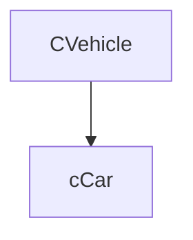
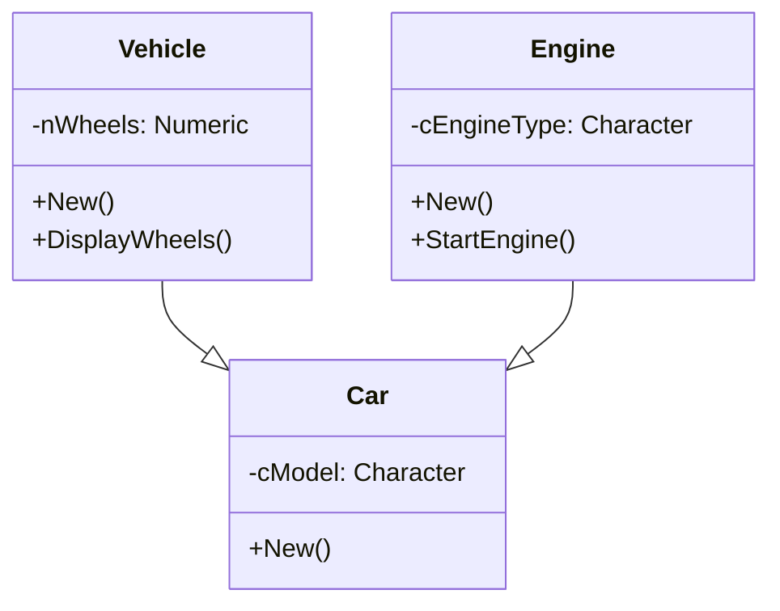
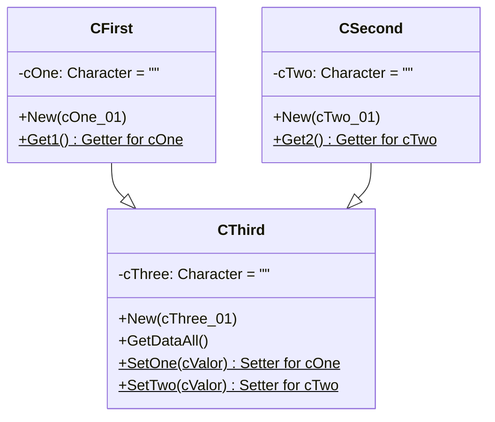

## Chapter 5: Inheritance: Code Reusability

-----

Inheritance is one of the most powerful pillars of Object-Oriented Programming, enabling you to build new classes based on existing ones. It's a mechanism that promotes **code reusability**, reduces redundancy, and establishes a natural "is-a" relationship between classes.

Imagine you have a general concept like "Vehicle." A "Car" is a type of Vehicle, and a "Motorcycle" is also a type of Vehicle. Both Cars and Motorcycles share common characteristics (they have wheels, they move, they carry passengers/cargo) but also have unique attributes (number of doors for a car, handlebars for a motorcycle). Inheritance allows you to model this relationship efficiently.

### 5.1 Concepts of **Parent Class (Base Class)** and **Child Class (Derived Class)**

In the context of inheritance:

  * **Parent Class (Base Class / Superclass):** This is the existing class from which a new class inherits. It provides common properties and methods that its descendants will share. Think of `CVehicle` in our example.
  * **Child Class (Derived Class / Subclass):** This is the new class that inherits from a parent class. It automatically gains all the public and protected properties and methods of its parent. It can then add its own unique properties and methods, or it can override (redefine) methods inherited from its parent to provide specific behavior. Think of `CCar` or `CMotorcycle`.

The relationship formed by inheritance is often described as an "**is-a**" relationship. For example:

  * A `CCar` **is a** `CVehicle`.
  * A `CSavingsAccount` **is an** `CAccount`.
  * A `CStudent` **is a** `CPerson`.

This relationship signifies that the child class is a more specialized version of the parent class.

### 5.2 The `INHERIT` Clause

In Harbour, you establish an inheritance relationship using the `INHERIT` clause within the `CLASS` definition.

**Syntax:**

```harbour
CLASS ChildClassName INHERIT ParentClassName
   // New properties specific to ChildClassName
   // New methods specific to ChildClassName
   // Overridden methods (redefinitions of parent methods)
ENDCLASS
```

  * `ChildClassName`: The name of your new class that will inherit.
  * `ParentClassName`: The name of the existing class from which `ChildClassName` will inherit.

**How it Works:**

When `ChildClassName` inherits from `ParentClassName`, the `ChildClassName` automatically "receives" all:

  * `PUBLIC VAR` properties
  * `PROTECTED VAR` properties
  * `PUBLIC METHOD`s
  * `PROTECTED METHOD`s

`HIDDEN VAR`s and `HIDDEN METHOD`s of the parent class are **not** inherited by the child class; they remain entirely private to the parent.

### 5.3 **Method Overriding**: Customizing Parent Behavior

**Method overriding** is a key feature of inheritance that allows a child class to provide a specific implementation for a method that is already defined in its parent class. When an overridden method is called on an object of the child class, the child's version of the method is executed instead of the parent's.

This is useful when the general behavior defined in the parent class needs to be specialized or changed for the child class.

**Example:**

A `CVehicle` might have a general `StartEngine()` method. A `CCar` (inheriting from `CVehicle`) might override `StartEngine()` to include specific car checks (e.g., check if doors are closed) before actually starting the engine.

```harbour
#include "hbclass.ch"  // Include Harbour's Object-Oriented Class framework

/*
* Class: CVehicle
* Description: Base class representing generic vehicle behavior
* Method:
*   StartEngine() - Basic engine startup procedure
* Design: Serves as parent class for specific vehicle types
*/
CLASS CVehicle
   METHOD StartEngine()  // Declare the engine start method
ENDCLASS

/*
* Method: StartEngine (CVehicle implementation)
* Behavior: Provides generic vehicle startup sequence
* Output: Prints simple startup message
* Returns: NIL (no specific return value needed)
*/
METHOD StartEngine() CLASS CVehicle
   QOut( "Generic vehicle engine starting." )  // Print to console
RETURN NIL

/*
* Class: CCar
* Description: Derived class representing car-specific behavior
* Inheritance: INHERIT keyword specifies CVehicle as parent
* Method Overriding:
*   StartEngine() - Replaces parent's implementation
* Design Pattern: Specialization of base class
*/
CLASS CCar INHERIT CVehicle
   METHOD StartEngine()  // Override parent's method
ENDCLASS

/*
* Method: StartEngine (cCar implementation)
* Behavior: Provides car-specific startup sequence
* Differences from parent:
*   - Additional pre-start checks
*   - More detailed startup procedure
* Output: Prints multi-step startup messages
*/
METHOD StartEngine() CLASS CCar
   QOut( "Checking car doors..." )          // Step 1: Pre-start check
   QOut( "Engaging car ignition sequence." ) // Step 2: Startup procedure
RETURN NIL

/*
* Procedure: main
* Purpose: Demonstrates inheritance and method overriding
* Creates:
*   1. Base vehicle instance
*   2. Car instance (derived from vehicle)
* Calls:
*   StartEngine() on both to show different behaviors
*/
PROCEDURE main()
   // Create instances
   LOCAL oVehicle := CVehicle():New()  // Base class instance
   LOCAL oCar     := CCar():New()      // Derived class instance

   // Demonstrate method behavior
   oVehicle:StartEngine() // Output: "Generic vehicle engine starting."
   oCar:StartEngine()     // Output: Car-specific messages

RETURN
```
**Inheritance Hierarchy**:



### ✅ GENERAL PURPOSE OF THE CODE

This Harbour code is a classic demonstration of **inheritance** and **polymorphism** using classes. It shows how a **base class** can define general behavior (`StartEngine()`), and how a **child class** can **override** this behavior to provide a more specific implementation.

---

## 🔍 LINE-BY-LINE ANALYSIS AND COMMENTS

```harbour
#include "hbclass.ch"  // Include Harbour's Object-Oriented Class framework
```

* This line includes the header needed to use Harbour’s class system (`CLASS`, `METHOD`, etc.).

---

### 🔹 Base Class: `CVehicle`

```harbour
CLASS CVehicle
   METHOD StartEngine()  // Declare the engine start method
ENDCLASS
```

* This defines a **generic vehicle class** with one method: `StartEngine`.
* Acts as the **base class** in the inheritance hierarchy.

```harbour
METHOD StartEngine() CLASS CVehicle
   QOut( "Generic vehicle engine starting." )  // Print to console
RETURN NIL
```

* Implements the base method, simulating a generic engine startup.
* `QOut` prints to the console.
* `RETURN NIL` is used as no return value is expected.

---

### 🔹 Derived Class: `CCar`

```harbour
CLASS CCar INHERIT CVehicle
   METHOD StartEngine()  // Override parent's method
ENDCLASS
```

* Declares `CCar` as a **child class** of `CVehicle` using the `INHERIT` keyword.
* Overrides the `StartEngine()` method to customize car-specific behavior.

```harbour
METHOD StartEngine() CLASS CCar
   QOut( "Checking car doors..." )           // Step 1: Pre-start check
   QOut( "Engaging car ignition sequence." ) // Step 2: Startup procedure
RETURN NIL
```

* The overridden method adds behavior:

  1. Checks car doors before starting
  2. Simulates engaging the car’s ignition
* Demonstrates **method overriding** clearly.

---

### 🔹 Main Procedure

```harbour
PROCEDURE main()
   LOCAL oVehicle := CVehicle():New()  // Base class instance
   LOCAL oCar     := CCar():New()      // Derived class instance
```

* Creates two instances:

  * `oVehicle` from the base class
  * `oCar` from the derived class

```harbour
   oVehicle:StartEngine() // Output: "Generic vehicle engine starting."
   oCar:StartEngine()     // Output: Car-specific messages
RETURN
```

* Calls the `StartEngine()` method on both instances.
* Demonstrates that:

  * `oVehicle` uses the base method.
  * `oCar` uses the overridden method.
* This confirms **polymorphism** is working.

---

## 🧠 KEY OOP CONCEPTS DEMONSTRATED

| Concept               | Explanation                                                     |
| --------------------- | --------------------------------------------------------------- |
| **Encapsulation**     | Methods encapsulate logic.                                      |
| **Inheritance**       | `CCar` inherits from `CVehicle`.                                |
| **Method Overriding** | `StartEngine()` is redefined in `CCar`.                         |
| **Polymorphism**      | Same method call behaves differently depending on object class. |

---

## ✅ BEST PRACTICES USED

* Clear **separation of base and derived class behavior**.
* Clean, readable class and method structure.
* Use of **descriptive console outputs** to track behavior flow.

---

## 🧱 EXTENSION IDEAS

To make this code more useful in real-world applications:

* Add more vehicle types (e.g., `CBike`, `CTruck`) with different overrides.
* Add attributes like fuel type, speed, capacity.
* Include **abstract base methods** or interfaces (Harbour does not support this natively, but it can be simulated).
* Add a UI or menu to select vehicle type and simulate actions interactively.

---
## 🧪 Output Sample

```text
Generic vehicle engine starting.
Checking car doors...
Engaging car ignition sequence.
```

## ✅ SUMMARY

This code is a **solid educational example** of Harbour's object-oriented features:

* It shows **inheritance and polymorphism** in a clear and minimal way.
* It's useful as a **template for larger applications** where different objects share similar behavior with specific customizations.
* With additional methods and attributes, it can evolve into a functional component of a simulation or management system.

### 5.4 Calling the **Parent Constructor**: `::SUPER:New()`

One of the most common and important uses of the `SUPER` keyword (introduced conceptually in Chapter 3) is to call the parent class's constructor from within the child class's constructor.

When you create an object of a child class, only the child class's `New()` method is automatically invoked. If the parent class's `New()` method contains important initialization logic (e.g., setting up base properties), you **must explicitly call it** from the child's constructor using `SUPER:New()`.

It is good practice to call `SUPER:New()` as the first line in the child class's constructor, ensuring the parent part of the object is fully initialized before the child adds its own specifics.

**Syntax:**

```harbour
CLASS ChildClassName INHERIT ParentClassName
ENDCLASS
   
METHOD New( [ChildParams], [ParentParams] )
      ::New( [ParentParams] ) // Call the parent's constructor
      // Child-specific initialization using :: properties
RETURN SELF
```

### 5.5 Multi-level Inheritance and Multiple Inheritance (Harbour's approach)

  * **Multi-level Inheritance:** This occurs when a class inherits from another class, which in turn inherits from yet another class.

      * `ClassC INHERIT ClassB`
      * `ClassB INHERIT ClassA`
      * This creates a hierarchy: `ClassA` -\> `ClassB` -\> `ClassC`. This is fully supported and common in Harbour.

  * **Multiple Inheritance:** This refers to a class inheriting directly from **more than one** parent class (e.g., `ClassC INHERIT ClassA, ClassB`).

      * Traditional OOP languages like C++ support multiple inheritance, which can lead to complex issues like the "diamond problem" (where a class inherits from two parents that share a common ancestor, leading to ambiguity).

```harbour
CLASS ChildClass FROM ParentClass1, ParentClass2, ParentClass3
   // Class implementation
ENDCLASS
```  

```harbour
/**
 * file
 * brief Demonstration of multiple inheritance in Harbour
 */

#include "hbclass.ch"

/**
 * class Vehicle
 * brief Base class representing vehicle properties
 */
CLASS Vehicle
   /**
    * var nWheels
    * brief Number of wheels the vehicle has
    */
   VAR nWheels

   /**
    * method New
    * brief Constructor for Vehicle class
    * return Self reference
    */
   METHOD New() CONSTRUCTOR

   /**
    * method DisplayWheels
    * brief Displays the number of wheels
    * return NIL
    */
   METHOD DisplayWheels()
ENDCLASS

/**
 * brief Initializes Vehicle instance with default values
 */
METHOD New() CLASS Vehicle
   ::nWheels := 4  // Default to 4 wheels for most vehicles
RETURN Self

/**
 * brief Outputs wheel count information to console
 */
METHOD DisplayWheels() CLASS Vehicle
   ? "Number of wheels:", ::nWheels  // Display wheel count
RETURN NIL

/**
 * class Engine
 * brief Base class representing engine properties
 */
CLASS Engine
   /**
    * var cEngineType
    * brief Type of engine (e.g., "V8", "Electric")
    */
   VAR cEngineType

   /**
    * method New
    * brief Constructor for Engine class
    * return Self reference
    */
   METHOD New() CONSTRUCTOR

   /**
    * method StartEngine
    * brief Simulates engine startup
    * return NIL
    */
   METHOD StartEngine()
ENDCLASS

/**
 * brief Initializes Engine instance with default values
 */
METHOD New() CLASS Engine
   ::cEngineType := "V8"  // Default to V8 engine
RETURN Self

/**
 * brief Outputs engine startup message to console
 */
METHOD StartEngine() CLASS Engine
   ? "Engine", ::cEngineType, "started!"  // Display engine status
RETURN NIL

/**
 * class Car
 * brief Derived class demonstrating multiple inheritance
 * extends Vehicle
 * extends Engine
 */
CLASS Car FROM Vehicle, Engine
   /**
    * var cModel
    * brief Model name of the car
    */
   VAR cModel

   /**
    * method New
    * brief Constructor for Car class
    * return Self reference
    */
   METHOD New() CONSTRUCTOR
ENDCLASS

/**
 * brief Initializes Car instance and parent classes
 */
METHOD New() CLASS Car
   ::Vehicle:New()  // Explicitly call Vehicle constructor
   ::Engine:New()   // Explicitly call Engine constructor
   ::cModel := "Generic"  // Set default model name
RETURN Self

/**
 * procedure Main
 * brief Entry point demonstrating multiple inheritance usage
 * return NIL
 */
PROCEDURE Main()
   LOCAL oCar := Car():New()  // Create Car instance

   oCar:DisplayWheels()  // Call inherited method from Vehicle
   oCar:StartEngine()    // Call inherited method from Engine
   ? "Model:", oCar:cModel  // Display car model

RETURN
```
 **Inheritance Hierarchy**:


### 🧾 FILE PURPOSE

```harbour
/**
 * file
 * brief Demonstration of multiple inheritance in Harbour
 */
```

This is a header comment stating that the file demonstrates multiple inheritance in Harbour. Harbour doesn't natively support **true multiple inheritance**, but in this example, it's syntactically declared as if it does.

---

## 🔧 Included Library

```harbour
#include "hbclass.ch"
```

Includes the **Harbour class system**, which is required for defining classes, variables (`VAR`, `DATA`), and methods (`METHOD`).

---

## 🚗 CLASS: `Vehicle`

```harbour
CLASS Vehicle
   VAR nWheels
   METHOD New() CONSTRUCTOR
   METHOD DisplayWheels()
ENDCLASS
```

### Purpose:

Represents generic **vehicle** behavior.
It has:

* `nWheels`: stores number of wheels (e.g., 4 for a car).
* `New()`: constructor that sets the number of wheels.
* `DisplayWheels()`: prints how many wheels the vehicle has.

```harbour
METHOD New() CLASS Vehicle
   ::nWheels := 4
RETURN Self
```

Sets default wheels to 4.

```harbour
METHOD DisplayWheels() CLASS Vehicle
   ? "Number of wheels:", ::nWheels
RETURN NIL
```

Displays the number of wheels.

---

## 🔧 CLASS: `Engine`

```harbour
CLASS Engine
   VAR cEngineType
   METHOD New() CONSTRUCTOR
   METHOD StartEngine()
ENDCLASS
```

### Purpose:

Represents a generic **engine**.

* `cEngineType`: e.g., "V8", "Electric"
* `New()`: sets default engine type.
* `StartEngine()`: prints message simulating engine startup.

```harbour
METHOD New() CLASS Engine
   ::cEngineType := "V8"
RETURN Self
```

```harbour
METHOD StartEngine() CLASS Engine
   ? "Engine", ::cEngineType, "started!"
RETURN NIL
```

---

## 🚙 CLASS: `Car` — Simulated Multiple Inheritance

```harbour
CLASS Car FROM Vehicle, Engine
   VAR cModel
   METHOD New() CONSTRUCTOR
ENDCLASS
```

### Purpose:

Combines **Vehicle** and **Engine** features into one **Car** object.

* Inherits from both `Vehicle` and `Engine`.
* Has its own `cModel` property (e.g., "Civic", "Tesla").
* Implements `New()` constructor that initializes both parents.

```harbour
METHOD New() CLASS Car
   ::Vehicle:New()   // Initialize Vehicle part
   ::Engine:New()    // Initialize Engine part
   ::cModel := "Generic"  // Car's own property
RETURN Self
```

⚠️ **Important**: Since Harbour doesn't automatically call parent constructors, we explicitly call:

* `::Vehicle:New()` for wheel setup
* `::Engine:New()` for engine setup

---

## 🧪 PROCEDURE: `Main`

```harbour
PROCEDURE Main()
   LOCAL oCar := Car():New()

   oCar:DisplayWheels()   // From Vehicle
   oCar:StartEngine()     // From Engine
   ? "Model:", oCar:cModel

RETURN
```

### Purpose:

Demonstrates the use of the `Car` class and its inherited methods.

Steps:

1. Create a `Car` instance.
2. Display number of wheels using `Vehicle` method.
3. Start engine using `Engine` method.
4. Show the model name from the `Car` class itself.

---

### ✅ Summary Table

| **Class** | **Property**  | **Methods**                | **Role**                       |
| --------- | ------------- | -------------------------- | ------------------------------ |
| `Vehicle` | `nWheels`     | `New()`, `DisplayWheels()` | Base class for vehicles        |
| `Engine`  | `cEngineType` | `New()`, `StartEngine()`   | Base class for engine behavior |
| `Car`     | `cModel`      | `New()`                    | Composite class combining both |

---

### 🧠 Key Concepts Demonstrated

* ✅ Class declaration using `CLASS ... FROM ...`
* ✅ Simulated **multiple inheritance** via explicit constructor calls
* ✅ Encapsulation of properties using `VAR`
* ✅ Use of method delegation (e.g., `::Vehicle:New()`)
* ✅ Clear documentation of purpose for each class and method

---

### ⚠️ Note on Harbour OOP Limitation

While Harbour **syntactically allows multiple inheritance** (e.g., `CLASS Car FROM A, B`), the behavior might vary across different Harbour builds. To be safe and compatible:

* Always call each parent’s constructor manually.
* Use `::ParentClass:Method()` to avoid ambiguity.

---
## 🧪 Output Sample

```text
Number of whells:    4
Engine V8 started!
Model: Generic
```
---
   
```harbour
/**
 * file
 * brief Demonstration of multiple inheritance with data access methods
 */

#include "hbclass.ch"

/**
 * class CFirst
 * brief First base class containing single string property
 */
CLASS CFirst
      /**
       * var cOne
       * brief Character data storage initialized as empty string
       */
      DATA cOne AS CHARACTER INIT ""

      /**
       * method New
       * brief Constructor for CFirst class
       * param cOne_01 Initial value for cOne property
       * return Self reference
       */
      METHOD New(cOne_01)

      /**
       * method Get1
       * brief Inline getter method for cOne property
       * return Current value of cOne
       */
      METHOD Get1() INLINE ::cOne
ENDCLASS

/**
 * brief Initializes CFirst instance with provided value
 */
METHOD New(cOne_01) CLASS CFirst
      ::cOne := cOne_01  // Set instance value from parameter
RETURN SELF


/**
 * class CSecond
 * brief Second base class containing single string property
 */
CLASS CSecond
      /**
       * var cTwo
       * brief Character data storage initialized as empty string
       */
      DATA cTwo AS CHARACTER INIT ""

      /**
       * method New
       * brief Constructor for CSecond class
       * param cTwo_01 Initial value for cTwo property
       * return Self reference
       */
      METHOD New(cTwo_01)

      /**
       * method Get2
       * brief Inline getter method for cTwo property
       * return Current value of cTwo
       */
      METHOD Get2() INLINE ::cTwo
ENDCLASS

/**
 * brief Initializes CSecond instance with provided value
 */
METHOD New(cTwo_01) CLASS CSecond
      ::cTwo := cTwo_01  // Set instance value from parameter
RETURN SELF


/**
 * class CThird
 * brief Derived class demonstrating multiple inheritance
 * extends CFirst
 * extends CSecond
 */
CLASS CThird FROM CFirst, CSecond
      /**
       * var cThree
       * brief Additional character data specific to CThird
       */
      DATA cThree AS CHARACTER INIT ""

      /**
       * method New
       * brief Constructor for CThird class
       * param cThree_01 Initial value for cThree property
       * return Self reference
       */
      METHOD New(cThree_01)

      /**
       * method GetDataAll
       * brief Displays all data values from all inheritance levels
       * return NIL
       */
      METHOD GetDataAll()

      /**
       * method SetOne
       * brief Inline setter for inherited cOne property
       * param cValor New value for cOne
       * return NIL
       */
      METHOD SetOne(cValor) INLINE ::cOne := cValor

      /**
       * method SetTwo
       * brief Inline setter for inherited cTwo property
       * param cValor New value for cTwo
       * return NIL
       */
      METHOD SetTwo(cValor) INLINE ::cTwo := cValor
ENDCLASS

/**
 * brief Initializes CThird instance with provided value
 */
METHOD New(cThree_01) CLASS CThird
      ::cThree := cThree_01  // Set instance-specific value
RETURN SELF

/**
 * brief Outputs all data values to console
 */
METHOD GetDataAll() CLASS CThird
      ? ::CFirst:Get1()  // Display value from first parent
      ? ::CSecond:Get2() // Display value from second parent
      ? ::cThree         // Display own value
RETURN

/**
 * procedure main
 * brief Entry point demonstrating multiple inheritance usage
 * return NIL
 */
PROCEDURE main()
     LOCAL oThird  // Declare instance variable

     // Create instance and initialize with value
     oThird := CThird():New("Hello_03")

     // Set values through inherited methods
     oThird:SetOne("From One")  // Set first parent's property
     oThird:SetTwo("From Two")  // Set second parent's property

     // Display all values
     oThird:GetDataAll()

     // Wait for user input before exiting

RETURN
```

### 🔍 Overview

The code defines three classes:

* `CFirst`
* `CSecond`
* `CThird` (which inherits from both `CFirst` and `CSecond`)

Each class contains a character property (`DATA`) and some methods to initialize, access, and display those properties.

---

### 📦 Header

```harbour
#include "hbclass.ch"
```

This includes Harbour’s OOP class system definition, allowing the use of `CLASS`, `METHOD`, `DATA`, etc.

---

### 🧱 Class `CFirst`

```harbour
CLASS CFirst
   DATA cOne AS CHARACTER INIT ""
   METHOD New(cOne_01)
   METHOD Get1() INLINE ::cOne
ENDCLASS
```

* This is the **first base class**.
* `cOne` is a character property initialized as an empty string.
* `New()` is the constructor method that sets `cOne`.
* `Get1()` is an inline getter method that returns the value of `cOne`.

```harbour
METHOD New(cOne_01) CLASS CFirst
   ::cOne := cOne_01
RETURN SELF
```

Sets the value passed to the `cOne` property during object creation.

---

### 🧱 Class `CSecond`

```harbour
CLASS CSecond
   DATA cTwo AS CHARACTER INIT ""
   METHOD New(cTwo_01)
   METHOD Get2() INLINE ::cTwo
ENDCLASS
```

* Second base class.
* `cTwo` is its property.
* `New()` initializes the value.
* `Get2()` returns it.

```harbour
METHOD New(cTwo_01) CLASS CSecond
   ::cTwo := cTwo_01
RETURN SELF
```

Similar constructor to `CFirst`.

---

### 🧬 Class `CThird` (Simulated Multiple Inheritance)

```harbour
CLASS CThird FROM CFirst, CSecond
   DATA cThree AS CHARACTER INIT ""
   METHOD New(cThree_01)
   METHOD GetDataAll()
   METHOD SetOne(cValor) INLINE ::cOne := cValor
   METHOD SetTwo(cValor) INLINE ::cTwo := cValor
ENDCLASS
```

* This class **inherits from both CFirst and CSecond** syntactically.
* It introduces its own property `cThree`.
* `New()` is its constructor.
* `GetDataAll()` displays all three values (`cOne`, `cTwo`, `cThree`).
* `SetOne()` and `SetTwo()` are inline setter methods for inherited properties.

```harbour
METHOD New(cThree_01) CLASS CThird
   ::cThree := cThree_01
RETURN SELF
```

Initializes only its own property. Note: it **does not call the parent constructors** explicitly — the values for `cOne` and `cTwo` are set later via setters.

---

### 📤 Data Display Method

```harbour
METHOD GetDataAll() CLASS CThird
   ? ::CFirst:Get1()   // Access base class 1 getter
   ? ::CSecond:Get2()  // Access base class 2 getter
   ? ::cThree          // Own value
RETURN
```

* Prints values from all three levels.
* It uses explicit parent class qualification (`::CFirst:Get1()`, `::CSecond:Get2()`) to avoid ambiguity between inherited methods.

---

### 🏁 Main Procedure

```harbour
PROCEDURE main()
   LOCAL oThird

   oThird := CThird():New("Hello_03")

   oThird:SetOne("From One")
   oThird:SetTwo("From Two")

   oThird:GetDataAll()

   Inkey(0)
RETURN
```

1. Creates an instance of `CThird`, initializing `cThree`.
2. Sets values for `cOne` and `cTwo` via their respective setters.
3. Calls `GetDataAll()` to print all values.
4. Waits for a key press.

---

### ✅ Summary

| Class     | Property | Constructor | Getter         | Setter                    | Notes         |
| --------- | -------- | ----------- | -------------- | ------------------------- | ------------- |
| `CFirst`  | `cOne`   | `New()`     | `Get1()`       | `SetOne()` in child       | First base    |
| `CSecond` | `cTwo`   | `New()`     | `Get2()`       | `SetTwo()` in child       | Second base   |
| `CThird`  | `cThree` | `New()`     | `GetDataAll()` | `SetOne()` and `SetTwo()` | Inherits both |

---

### 🧠 Important Concepts Demonstrated

* Simulated **multiple inheritance**.
* Use of **inline getter/setter**.
* **Composition of behavior** through delegation (`::CFirst:Get1()`).
* Structured **documentation style comments**.

---
## 🧪 Output Sample

```text
From One
From Two
Hello_03
```
---
 

### 5.6 Code Examples: `CAnimal` as Base, `CDog` and `CCat` as Derived

Let's illustrate inheritance with a simple `cAnimal` base class and `cDog`, `cCat` derived classes.

```harbour
// File: CAnimal.prg
// Defines the base CAnimal class
#include "hbclass.ch"

CLASS CAnimal
   // Protected property: accessible by CAnimal and its children
   VAR cSpecies AS CHARACTER PROTECTED
   VAR cName    AS CHARACTER PROTECTED
   VAR nAge     AS NUMERIC   PROTECTED

   // Constructor for cAnimal
   METHOD New( cSpeciesParam, cNameParam, nAgeParam )
   // Public method for all animals
   METHOD Speak()
   // Public getter for common info
   METHOD GetInfo()

ENDCLASS

// Constructor for CAnimal
METHOD New( cSpeciesParam, cNameParam, nAgeParam )  CLASS CAnimal
   ::cSpecies := If( ValType( cSpeciesParam ) == 'C', cSpeciesParam, "Unknown" )
   ::cName    := If( ValType( cNameParam )    == 'C', cNameParam,    "NoName"  )
   ::nAge     := If( ValType( nAgeParam )     == 'N', nAgeParam,     0         )
   QOut( "CAnimal: New instance of " + ::cSpecies + " created." )
RETURN SELF

// Public method for all animals
METHOD Speak() CLASS CAnimal
   QOut( "Generic animal sound." )
RETURN //NIL

// Public getter for common info
METHOD GetInfo() CLASS CAnimal
RETURN "Species: " + ::cSpecies + ", Name: " + ::cName + ", Age: " + LTrim( Str( ::nAge ) )
```

```harbour
// File: cdog.prg
// Defines the CDog class, inheriting from CAnimal
#include "hbclass.ch" // Required for INHERIT

CLASS CDog INHERIT CAnimal
   // New property specific to cDog
   VAR lIsTrained AS LOGICAL

   // cDog's Constructor
   METHOD New( cNameParam, nAgeParam, lTrainedParam )
   // Override the Speak method from CAnimal
   METHOD Speak()
   // New method specific to CDog
   METHOD Fetch()

ENDCLASS

// cDog's Constructor
METHOD New( cNameParam, nAgeParam, lTrainedParam ) CLASS CDog
   // CRITICAL: Call the parent's constructor first!
   ::Super:New( "Dog", cNameParam, nAgeParam ) // Pass parameters to cAnimal's constructor

   // Initialize cDog specific properties
   ::lIsTrained := If( ValType( lTrainedParam ) == 'L', lTrainedParam, .F. )
   QOut( "cDog: " + ::cName + " initialized." )

RETURN SELF

// Override the Speak method from CAnimal
METHOD Speak() CLASS cDog
   QOut( ::cName + " says Woof! Woof!" )
RETURN NIL

// New method specific to CDog
METHOD Fetch() CLASS cDog
   QOut( ::cName + " fetches the ball." )
RETURN NIL
```

```harbour
// File: ccat.prg
// Defines the cCat class, inheriting from CAnimal
//#include "hbclass.ch" // Required for INHERIT

CLASS CCat INHERIT cAnimal
   // New property specific to CCat
   VAR lIsIndoor AS LOGICAL

   // CCat's Constructor
   METHOD New( cNameParam, nAgeParam, lIndoorParam )
   // Override the Speak method from CAnimal (different sound)
   METHOD Speak()
   // New method specific to cCat
   METHOD Climb()

ENDCLASS

// cCat's Constructor
METHOD New( cNameParam, nAgeParam, lIndoorParam ) CLASS CCat
   // Call the parent's constructor
   ::Super:New( "Cat", cNameParam, nAgeParam )   //super

   // Initialize CCat specific properties
   ::lIsIndoor := If( ValType( lIndoorParam ) == 'L', lIndoorParam, .T. )
   QOut( "CCat: " + ::cName + " initialized." )
RETURN SELF

// Override the Speak method from CAnimal (different sound)
METHOD Speak() CLASS CCat
   QOut( ::cName + " says Meow." )
RETURN NIL

// New method specific to CCat
METHOD Climb() CLASS CCat
   QOut( ::cName + " climbs the curtains." )
RETURN NIL
```

```harbour
// --- File: main.prg (Example of using inherited classes) ---
#include "hbclass.ch" // Essential for OOP features
#include "inkey.ch"   // For QOut

PROCEDURE Main()

   LOCAL oGenericAnimal AS OBJECT
   LOCAL oMyDog         AS OBJECT
   LOCAL oMyCat         AS OBJECT

   QOut( "--- Creating Objects ---" )

   // Create a base animal object
   oGenericAnimal := CAnimal():New( "Bird", "Tweety", 2 )
   QOut( oGenericAnimal:GetInfo() )
   oGenericAnimal:Speak()

   QOut( "" )

   // Create a Dog object (inherits from cAnimal)
   oMyDog := CDog():New( "Buddy", 5, .T. )

   QOut( oMyDog:GetInfo() ) // GetInfo is inherited from CAnimal
   oMyDog:Speak()          // Calls CDog's overridden Speak method
   oMyDog:Fetch()          // Calls CDog's specific method
   QOut( "Buddy is trained: " + If( oMyDog:lIsTrained, "Yes", "No" ) ) // Access specific property

   QOut( "" )

   // Create a Cat object (inherits from cAnimal)
   oMyCat := CCat():New( "Whiskers", 3, .T. )
   QOut( oMyCat:GetInfo() ) // GetInfo is inherited from CAnimal
   oMyCat:Speak()          // Calls CCat's overridden Speak method
   oMyCat:Climb()          // Calls CCat's specific method
   QOut( "Whiskers is indoor: " + If( oMyCat:lIsIndoor, "Yes", "No" ) ) // Access specific property

   QOut( "" )
   QOut( "--- Demonstrating SUPER (behind the scenes) ---" )
   // The QOut messages from the constructors show SUPER:New() working.
   // "CAnimal: New instance of Dog created." is from cAnimal's constructor
   // "CDog: Buddy initialized." is from cDog's constructor.

RETURN
```
 **Inheritance Hierarchy**:
   ```mermaid
   graph TD
     A[cAnimal] --> B[cDog]
     A --> C[cCat]
   ```

## 🔍 Code Analysis

### ✅ 1. **File: `cAnimal.prg` (Base Class)**

```harbour
CLASS CAnimal
   VAR cSpecies AS CHARACTER PROTECTED
   VAR cName    AS CHARACTER PROTECTED
   VAR nAge     AS NUMERIC   PROTECTED
```

* **PROTECTED attributes** mean these properties are only accessible within the class and subclasses (not from outside the object).
* The class defines general properties that all animals share: species, name, and age.

```harbour
METHOD New( cSpeciesParam, cNameParam, nAgeParam )
```

* Constructor initializes the object safely by validating parameter types.

```harbour
METHOD Speak()
```

* A **generic method** that is meant to be **overridden** in subclasses. Represents polymorphism.

```harbour
METHOD GetInfo()
```

* Returns a string with the animal's details. This is useful for introspection or debugging.

---

### ✅ 2. **File: `cdog.prg` (Derived Class - Dog)**

```harbour
CLASS CDog INHERIT CAnimal
   VAR lIsTrained AS LOGICAL
```

* **Inherits from `CAnimal`**.
* Adds its own property: whether the dog is trained.

```harbour
::Super:New( "Dog", cNameParam, nAgeParam )
```

* Calls the **parent constructor** using `Super:New()` — this is critical for proper inheritance initialization.
* Hardcodes `"Dog"` for the species field (good design for clarity).

```harbour
METHOD Speak()
```

* Overrides the base `Speak()` method to give **dog-specific behavior** ("Woof!").

```harbour
METHOD Fetch()
```

* A **new method specific** to dogs — not found in the base class.

---

### ✅ 3. **File: `ccat.prg` (Derived Class - Cat)**

```harbour
CLASS CCat INHERIT CAnimal
   VAR lIsIndoor AS LOGICAL
```

* Adds a cat-specific property: whether the cat is an indoor pet.

```harbour
::Super:New( "Cat", cNameParam, nAgeParam )
```

* Properly initializes inherited fields with `"Cat"` as species.

```harbour
METHOD Climb()
```

* Unique behavior only available in the `cCat` class.

```harbour
METHOD Speak()
```

* Overrides base `Speak()` with `"Meow"` — demonstrates polymorphism.

---

### ✅ 4. **File: `main.prg` (Test Program)**

```harbour
LOCAL oGenericAnimal AS OBJECT
LOCAL oMyDog         AS OBJECT
LOCAL oMyCat         AS OBJECT
```

* Declares three polymorphic objects: a base animal, a dog, and a cat.

```harbour
oGenericAnimal := CAnimal():New( "Bird", "Tweety", 2 )
```

* Demonstrates instantiating the base class directly (allowed but usually abstracted in real-world designs).

```harbour
oMyDog := CDog():New( "Buddy", 5, .T. )
```

* Shows inheritance in action — uses methods from both the parent (`GetInfo`) and child class (`Fetch`).

```harbour
oMyCat := CCat():New( "Whiskers", 3, .T. )
```

* Same idea with the `cCat` class.

### 📌 Output Behavior Highlights

* Calls to `Speak()` are polymorphic.
* Constructors print messages that demonstrate the call order (`CAnimal` → `cDog`/`cCat`).
* Use of **inherited vs. overridden methods** is clearly demonstrated.

---

## 🧠 Object-Oriented Concepts in Action

| Concept                  | Where It Appears                    | Description                               |
| ------------------------ | ----------------------------------- | ----------------------------------------- |
| **Encapsulation**        | `PROTECTED` properties              | Hides internal state from external access |
| **Inheritance**          | `INHERIT cAnimal` in `cDog`, `cCat` | Reuse of base attributes/methods          |
| **Polymorphism**         | `Speak()` method override           | Same method name, different behavior      |
| **Method Overriding**    | `cDog:Speak()`, `cCat:Speak()`      | Custom implementation of inherited method |
| **Constructor Chaining** | `::Super:New()`                     | Ensures proper base class initialization  |

---
## 🧪 Output Sample

```text
--- Creating Objects ---
CAnimal: New instance of Bird created.
Species: Bird, Name: Tweety, Age: 2
Generic animal sound.

CAnimal: New instance of Dog created.
cDog: Buddy initialized.
Species: Dog, Name: Buddy, Age: 5
Buddy says Woof! Woof!
Buddy fetches the ball.
Buddy is trained: Yes

CAnimal: New instance of Cat created.
CCat: Whiskers initialized.
Species: Cat, Name: Whiskers, Age: 3
Whiskers says Meow.
Whiskers climbs the curtains.

--- Demonstrating SUPER (behind the scenes) ---
```
---
