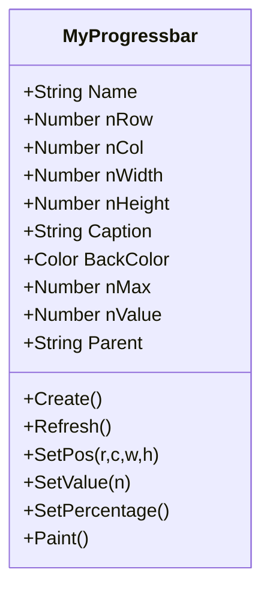
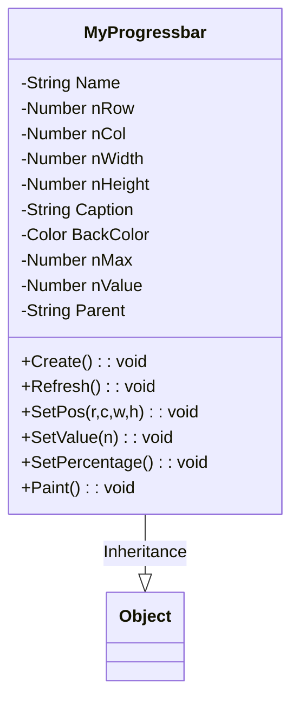
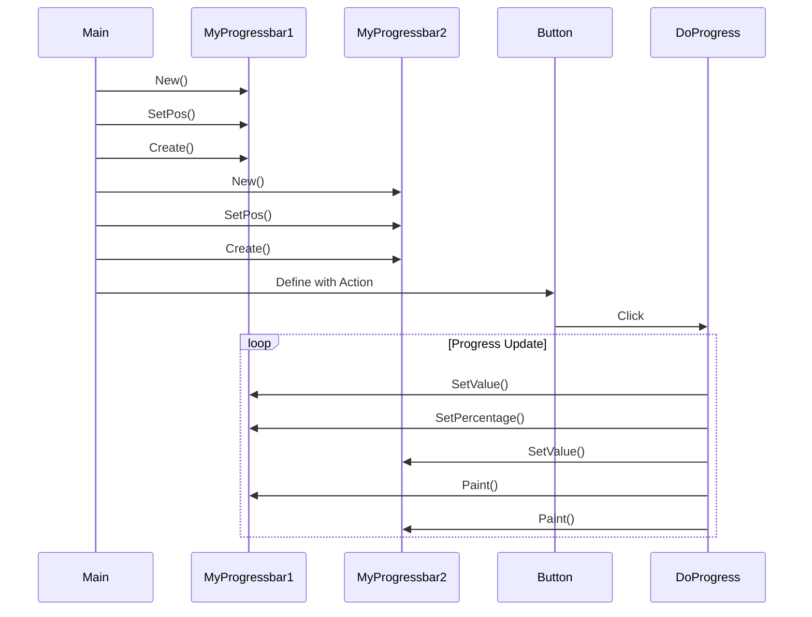

# 🚀 Harbour Custom Progress Bar Analysis

## 🔍 Code Overview
This Harbour code demonstrates how to create a **custom progress bar control** using HMG (Harbour MiniGUI) Extended. The implementation shows object-oriented programming in Harbour with a focus on GUI controls.

## 🌟 Main Components

### 1️⃣ **Main Procedure** (`Main()`)
- Creates the main application window
- Instantiates two custom progress bars (`MyProgressbar` class)
- Adds a button to trigger progress updates
- 🎨 Customizable properties: position, size, colors, captions

### 2️⃣ **Progress Handler** (`DoProgress()`)
- Increments both progress bars simultaneously
- Updates percentage display
- Includes a small delay for visual effect

### 3️⃣ **Custom Progress Bar Class** (`MyProgressbar`)
- 🏗️ Encapsulates all progress bar functionality
- 📊 Handles visual representation (growing label)
- 🔢 Manages values and percentages

## 📊 Inheritance Hierarchy

## 🏗️ UML Class Diagram

## 🛠️ Key Features

1. **Custom Control Creation** 🎛️
   - Uses HMG's window system to create panel-based progress bars
   - Implements visual progress using a resizable label

2. **Object-Oriented Design** 🧱
   - Encapsulates all progress bar functionality in a single class
   - Provides clean methods for interaction (SetValue, Refresh, etc.)

3. **Visual Feedback** 👀
   - Percentage display updates in real-time
   - Smooth animation with controlled delay

4. **Flexible Configuration** ⚙️
   - Customizable size, position, colors
   - Adjustable maximum value

## 🔄 Workflow Diagram

This implementation demonstrates how to extend HMG's capabilities with custom controls using Harbour's OOP features, providing a reusable progress bar component for GUI applications.
