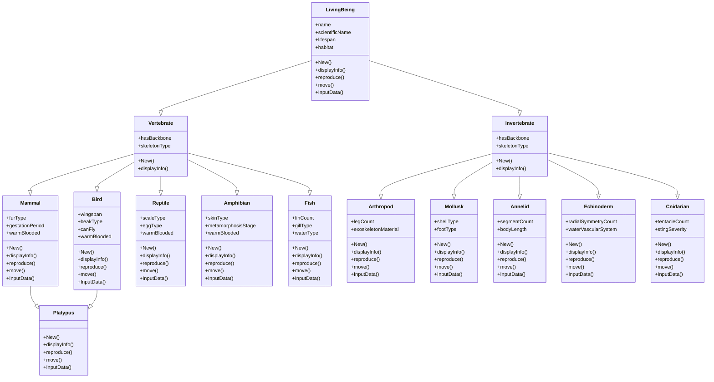

## 🌿 **High-Level Overview**

This code defines a **Biological Classification System** in Harbour, using **Object-Oriented Programming (OOP)** concepts such as:

* **Inheritance** 🧬 – Shared structure among organisms (e.g., mammals, birds, reptiles).
* **Polymorphism** 🌀 – Common methods like `move()` and `reproduce()` are overridden in subclasses.
* **Multiple Inheritance** 🔀 – The `Platypus` class combines traits from `Mammal` and `Bird`.
* **Encapsulation** 🔒 – Each class holds its own data (`name`, `lifespan`, etc.) and methods.

The UI is **text-based**, using `@ ... SAY`, `InKey()`, and `GET/READ`, which makes it console-friendly and portable.

---

## 🔧 `Main()` Function

```harbour
FUNCTION Main()
   LOCAL oSystem := BioClassificationSystem():New()
   oSystem:Run()
RETURN NIL
```

✅ **Purpose**: The program entry point creates an instance of the system and starts it.

---

## 🧠 `BioClassificationSystem` Class

### 📦 Properties:

* `aOrganisms` – An array storing all created organism objects.

### 🧱 Constructor (`New()`):

```harbour
::aOrganisms := {}
AAdd(... predefined organisms ...)
```

✅ **Initializes** the system with sample organisms (e.g., lion, eagle, platypus).

💡 Useful for demonstration or development phase.

---

### 🧭 `Run()` – Main Menu Loop

```harbour
DO WHILE .T.
   @ ... SAY ...
   nChoice := Val(Chr(Inkey(0)))
```

✅ Provides a looped menu for the user to interact with:

1. Create new organism 🐣
2. Display organism info 📋
3. Show inheritance hierarchy 🌲
4. Exit ❌

✅ Efficient use of `DO CASE` to delegate functionality.

---

### 🛠️ `CreateOrganism()` Method

✅ Lets the user choose a type of organism and creates it using its corresponding class.

```harbour
CASE nChoice == 1
   oOrganism := Mammal():New()
```

📌 Uses `InputData()` method on each class to capture properties interactively.

✅ **Extensible** – Easy to add more organism types in future.

---

### 📜 `DisplayOrganisms()` Method

✅ Iterates over `::aOrganisms` using `FOR EACH` and shows details using each object's `displayInfo()`.

👍 **Polymorphic design** – Each subclass can override `displayInfo()` to show additional data.

---

### 🧬 `DisplayHierarchy()` Method

✅ Static, hardcoded visual of inheritance relationships:

```harbour
@  3, 1 SAY "LivingBeing"
@  4, 3 SAY "|-- Vertebrate"
@  5, 5 SAY "|-- Mammal"
```

🎨 **Visualizes** the class structure. Helps users understand biological taxonomy.

---

## 🧬 `LivingBeing` – The Base Class

### 🎯 Purpose:

Defines properties and common behaviors of all living things.

### Properties:

* `name`, `scientificName`, `lifespan`, `habitat`

### Methods:

* `New(...)` – Constructor.
* `displayInfo()` – Returns formatted string with core data.
* `reproduce()` and `move()` – Default implementation to be overridden.
* `InputData()` – Collects data from the user using `GET/READ`.

### 💡 Notes:

* `InputData()` is **interactive**, using old-school Harbour console input.
* `displayInfo()` is simple but allows subclasses to expand output with `super:displayInfo()`.

---

## 🧬 OOP Features Demonstrated

### ✅ **Inheritance**:

All specific organisms inherit from `LivingBeing`, either directly or through `Vertebrate`/`Invertebrate`.

### ✅ **Polymorphism**:

The use of methods like `move()` and `reproduce()` is polymorphic – overridden in subclasses like `Bird`, `Fish`, etc.

### ✅ **Multiple Inheritance**:

The `Platypus` class combines traits from both `Mammal` and `Bird`. This is an advanced Harbour feature and adds realism to biological modeling.

🦆 Example:

* Platypus lays eggs (bird trait) 🥚
* Platypus has fur and lactates (mammal trait) 🐾

---

## 🧪 Strengths of This Design

* ✅ **Modular** – Easy to extend with more classes and behaviors.
* ✅ **Clean and Logical Class Hierarchy** – Based on real-world taxonomy.
* ✅ **User-Friendly Menu** – Simple for users to navigate and use.
* ✅ **Good use of Harbour OOP** – Demonstrates inheritance, encapsulation, polymorphism, and multiple inheritance.

---
### Inheritance Hierarchy Analysis
The code defines a class hierarchy for a biological classification system, starting with a base class `LivingBeing` and extending into `Vertebrate` and `Invertebrate` subclasses. Further specialized classes (e.g., `Mammal`, `Bird`, `Reptile`, etc.) inherit from these, with `Platypus` uniquely inheriting from both `Mammal` and `Bird` to model its dual characteristics. The hierarchy is as follows:
- `LivingBeing` (base class)
  - `Vertebrate`
    - `Mammal`
      - `Platypus` (also inherits from `Bird`)
    - `Bird`
      - `Platypus` (also inherits from `Mammal`)
    - `Reptile`
    - `Amphibian`
    - `Fish`
  - `Invertebrate`
    - `Arthropod`
    - `Mollusk`
    - `Annelid`
    - `Echinoderm`
    - `Cnidarian`

### Mermaid Class Diagram
Mermaid is used to represent the class hierarchy in a flowchart-style diagram. The Mermaid code below defines the inheritance relationships using `-->`, with `Platypus` showing multiple inheritance from `Mammal` and `Bird`.



### UML Class Diagram (Textual Description)
The UML class diagram is described textually below, as a direct UML diagram image cannot be generated here. The description includes classes, their attributes, methods, and inheritance relationships, formatted for clarity. This can be used to create a UML diagram in tools like PlantUML or draw.io.


UML Class Diagram Description for Biological Classification System

Classes and Relationships:
1. LivingBeing
   - Attributes:
     - name: string
     - scientificName: string
     - lifespan: number
     - habitat: string
   - Methods:
     - New(cName: string, cSciName: string, nLifespan: number, cHabitat: string)
     - displayInfo(): string
     - reproduce(): string
     - move(): string
     - InputData(): boolean

2. Vertebrate (inherits from LivingBeing)
   - Attributes:
     - hasBackbone: boolean = true
     - skeletonType: string = "internal"
   - Methods:
     - New(cName: string, cSciName: string, nLifespan: number, cHabitat: string)
     - displayInfo(): string

3. Invertebrate (inherits from LivingBeing)
   - Attributes:
     - hasBackbone: boolean = false
     - skeletonType: string = "external or none"
   - Methods:
     - New(cName: string, cSciName: string, nLifespan: number, cHabitat: string)
     - displayInfo(): string

4. Mammal (inherits from Vertebrate)
   - Attributes:
     - furType: string
     - gestationPeriod: number
     - warmBlooded: boolean = true
   - Methods:
     - New(cName: string, cSciName: string, nLifespan: number, cHabitat: string, cFurType: string, nGestation: number)
     - displayInfo(): string
     - reproduce(): string
     - move(): string
     - InputData(): boolean

5. Bird (inherits from Vertebrate)
   - Attributes:
     - wingspan: number
     - beakType: string
     - canFly: boolean
     - warmBlooded: boolean = true
   - Methods:
     - New(cName: string, cSciName: string, nLifespan: number, cHabitat: string, nWingspan: number, cBeakType: string, lCanFly: boolean)
     - displayInfo(): string
     - reproduce(): string
     - move(): string
     - InputData(): boolean

6. Reptile (inherits from Vertebrate)
   - Attributes:
     - scaleType: string
     - eggType: string
     - warmBlooded: boolean = false
   - Methods:
     - New(cName: string, cSciName: string, nLifespan: number, cHabitat: string, cScaleType: string, cEggType: string)
     - displayInfo(): string
     - reproduce(): string
     - move(): string
     - InputData(): boolean

7. Amphibian (inherits from Vertebrate)
   - Attributes:
     - skinType: string
     - metamorphosisStage: string
     - warmBlooded: boolean = false
   - Methods:
     - New(cName: string, cSciName: string, nLifespan: number, cHabitat: string, cSkinType: string, cMetaStage: string)
     - displayInfo(): string
     - reproduce(): string
     - move(): string
     - InputData(): boolean

8. Fish (inherits from Vertebrate)
   - Attributes:
     - finCount: number
     - gillType: string
     - waterType: string
   - Methods:
     - New(cName: string, cSciName: string, nLifespan: number, cHabitat: string, nFinCount: number, cGillType: string, cWaterType: string)
     - displayInfo(): string
     - reproduce(): string
     - move(): string
     - InputData(): boolean

9. Arthropod (inherits from Invertebrate)
   - Attributes:
     - legCount: number
     - exoskeletonMaterial: string
   - Methods:
     - New(cName: string, cSciName: string, nLifespan: number, cHabitat: string, nLegCount: number, cExoMaterial: string)
     - displayInfo(): string
     - reproduce(): string
     - move(): string
     - InputData(): boolean

10. Mollusk (inherits from Invertebrate)
    - Attributes:
      - shellType: string
      - footType: string
    - Methods:
      - New(cName: string, cSciName: string, nLifespan: number, cHabitat: string, cShellType: string, cFootType: string)
      - displayInfo(): string
      - reproduce(): string
      - move(): string
      - InputData(): boolean

11. Annelid (inherits from Invertebrate)
    - Attributes:
      - segmentCount: number
      - bodyLength: number
    - Methods:
      - New(cName: string, cSciName: string, nLifespan: number, cHabitat: string, nSegmentCount: number, nBodyLength: number)
      - displayInfo(): string
      - reproduce(): string
      - move(): string
      - InputData(): boolean

12. Echinoderm (inherits from Invertebrate)
    - Attributes:
      - radialSymmetryCount: number
      - waterVascularSystem: string
    - Methods:
      - New(cName: string, cSciName: string, nLifespan: number, cHabitat: string, nRadialCount: number, cWaterSystem: string)
      - displayInfo(): string
      - reproduce(): string
      - move(): string
      - InputData(): boolean

13. Cnidarian (inherits from Invertebrate)
    - Attributes:
      - tentacleCount: number
      - stingSeverity: string
    - Methods:
      - New(cName: string, cSciName: string, nLifespan: number, cHabitat: string, nTentacleCount: number, cStingSeverity: string)
      - displayInfo(): string
      - reproduce(): string
      - move(): string
      - InputData(): boolean

14. Platypus (inherits from Mammal, Bird)
    - Attributes: (inherits from Mammal and Bird)
    - Methods:
      - New(cName: string, cSciName: string, nLifespan: number, cHabitat: string, cFurType: string, nGestation: number, nWingspan: number, cBeakType: string, lCanFly: boolean)
      - displayInfo(): string
      - reproduce(): string
      - move(): string
      - InputData(): boolean

Inheritance Relationships:
- LivingBeing is the base class.
- Vertebrate and Invertebrate inherit from LivingBeing.
- Mammal, Bird, Reptile, Amphibian, and Fish inherit from Vertebrate.
- Arthropod, Mollusk, Annelid, Echinoderm, and Cnidarian inherit from Invertebrate.
- Platypus inherits from both Mammal and Bird (multiple inheritance).


### Explanation of Artifacts
- **Mermaid Diagram**: The Mermaid code defines a class diagram with all classes, their attributes, and methods, connected by inheritance arrows (`-->`). It can be rendered in tools supporting Mermaid (e.g., Mermaid Live Editor) to visualize the hierarchy.
- **UML Description**: The textual UML description lists each class’s attributes and methods and explicitly describes inheritance relationships. This can be used to manually create a UML diagram in tools like PlantUML, draw.io, or Visio.


---
## 🧠 Final Thoughts

👏 This code is a **strong educational example** of how OOP works in Harbour. It models a complex system with elegance and clarity, using **real-world metaphors** (biology!) to teach key principles.

🔥 With small additions like persistence and dynamic menus, this could evolve into a full-fledged educational or research tool!

---

