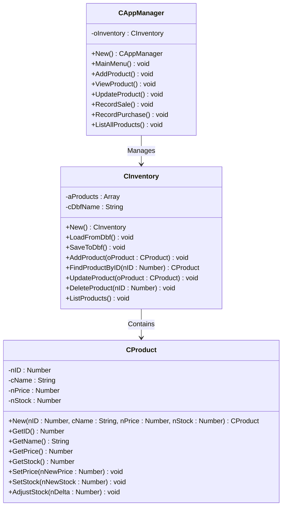

### Code Analysis 🚀

"Presents an object-oriented implementation of an Inventory Management System featuring a command-line user interface, demonstrating encapsulation, inheritance and polymorphism."😄

---

#### Overview 📋
The system is designed to manage a product inventory stored in a **DBF (dBase) file** called `products.dbf`. It provides a menu-driven interface for users to:
- Add, view, update, and delete products.
- Record sales and purchases to adjust stock levels.
- List all products in the inventory.

The codebase is organized into three main classes: 
1. **CAppManager** 🖥️: Controls the user interface and application workflow.
2. **CInventory** 📦: Manages product data storage and retrieval in memory and the DBF file.
3. **CProduct** 🛒: Represents individual product entities with attributes like ID, name, price, and stock.

The entry point is the `main()` procedure, which initializes the environment and launches the application.

---

#### Detailed Breakdown of Classes and Functionality 🔍

1. **CAppManager Class** 🖱️
   - **Purpose**: Acts as the application's controller, handling user interactions through a menu-driven interface.
   - **Key Methods**:
     - `New()`: Initializes the manager by creating a `CInventory` instance.
     - `MainMenu()`: Displays a menu with options (Add Product, View Product, Update Product, Record Sale, Record Purchase, List All Products, Exit) and processes user selections in a loop.
     - `AddProduct()`: Prompts the user for product details (ID, name, price, stock) and adds a new `CProduct` to the inventory.
     - `ViewProduct()`: Searches for a product by ID and displays its details.
     - `UpdateProduct()`: Updates the price and stock of an existing product by ID.
     - `RecordSale()`: Reduces stock for a product based on the quantity sold.
     - `RecordPurchase()`: Increases stock for a product based on the quantity purchased.
     - `ListAllProducts()`: Displays all products by delegating to `CInventory:ListProducts()`.
   - **UI Features**: Uses Harbour's `BOX` and `SAY/GET` commands to create a text-based UI with double-single line boxes for forms and menus.

2. **CInventory Class** 📚
   - **Purpose**: Manages the collection of products, handling storage in memory (via an array) and persistence in a DBF file (`products.dbf`).
   - **Key Methods**:
     - `New()`: Initializes an empty product array and loads existing data from the DBF file.
     - `LoadFromDbf()`: Reads records from `products.dbf` and creates `CProduct` objects for each non-deleted record.
     - `SaveToDbf()`: Clears the DBF file and writes all in-memory products back to it, ensuring no duplicate IDs.
     - `AddProduct(oProduct)`: Adds a product to the in-memory array and saves to the DBF.
     - `FindProductByID(nID)`: Performs a linear search to find a product by ID.
     - `UpdateProduct(oProduct)`: Replaces an existing product in the array and updates the DBF.
     - `DeleteProduct(nID)`: Removes a product from the array by ID and updates the DBF.
     - `ListProducts()`: Displays all products in the console.
   - **Data Management**: Uses Harbour's DBFCDX driver for indexed DBF file operations, ensuring unique product IDs via an index on the `ID` field.

3. **CProduct Class** 🧴
   - **Purpose**: Encapsulates a single product's data and behavior.
   - **Attributes** (all protected):
     - `nID`: Unique product identifier (numeric).
     - `cName`: Product name (character, up to 40 chars).
     - `nPrice`: Unit price (numeric, with 2 decimal places).
     - `nStock`: Current stock quantity (numeric).
   - **Key Methods**:
     - `New(nID, cName, nPrice, nStock)`: Initializes a product with the provided values.
     - `GetID()`, `GetName()`, `GetPrice()`, `GetStock()`: Inline getters for accessing attributes.
     - `SetPrice(nNewPrice)`: Updates the price if the input is numeric.
     - `SetStock(nNewStock)`: Updates the stock if the input is numeric.
     - `AdjustStock(nDelta)`: Adjusts stock by adding or subtracting the specified quantity.

4. **CreateProductTable Procedure** 🛠️
   - Creates the `products.dbf` file if it doesn't exist, defining a structure with fields:
     - `ID` (Numeric, 6 digits, no decimals)
     - `NAME` (Character, 40 chars)
     - `PRICE` (Numeric, 10 digits, 2 decimals)
     - `STOCK` (Numeric, 10 digits, no decimals)
   - Creates a unique index on the `ID` field to enforce data integrity.

5. **Main Procedure** 🌟
   - Sets up the runtime environment (e.g., enabling century for dates, setting the DBFCDX driver).
   - Checks for the existence of `products.dbf` and creates it if missing.
   - Instantiates `CAppManager` and starts the main menu loop.

---
#### UML Class Diagram 📊

Below is a UML class diagram in Mermaid, detailing the classes, their attributes, methods, and relationships.

**Explanation**:
- **Classes**: Each class is represented with its attributes (prefixed with `-` for protected) and methods (prefixed with `+` for public).
- **Relationships**:
  - `CAppManager` has a composition relationship with `CInventory` (via `oInventory`).
  - `CInventory` has a composition relationship with `CProduct` (via the `aProducts` array).
- **Attributes and Methods**: Fully listed with their types and return values for clarity.

---

#### Key Observations and Features 🌈
- **OOP Design**: The code uses Harbour's `hbclass.ch` to implement a clean object-oriented structure, with encapsulation (protected attributes in `CProduct`) and clear separation of concerns.
- **Persistence**: The `CInventory` class handles DBF file operations, ensuring data is persisted across sessions.
- **User Interface**: The text-based UI uses Harbour's `BOX`, `SAY`, and `GET` commands for a retro, console-based experience.
- **Error Handling**: Basic validation is implemented (e.g., checking for empty fields in `AddProduct`, numeric types in `SetPrice`/`SetStock`).
- **Extensibility**: The system could be extended to include additional features like reporting or advanced search.

---

#### Conclusion 🎉
This Harbour application is a well-structured, functional inventory management system that demonstrates OOP principles and DBF file handling. The `CAppManager`, `CInventory`, and `CProduct` classes work together seamlessly to provide a complete solution for managing product data. The Mermaid and UML diagrams above visualize the class relationships clearly, making it easy to understand the system's architecture.😊
